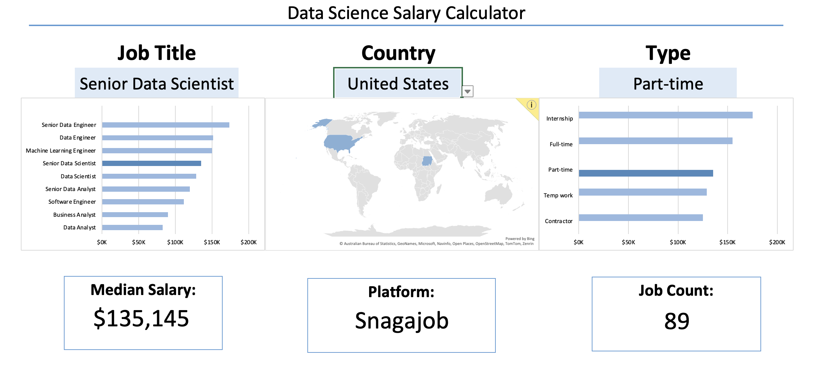
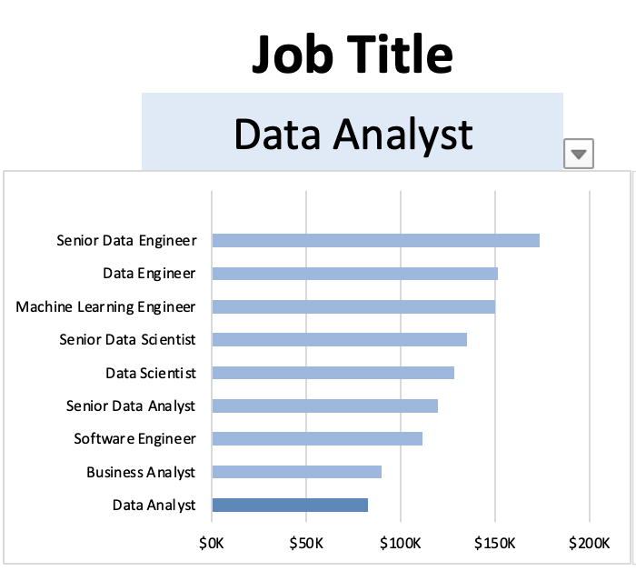
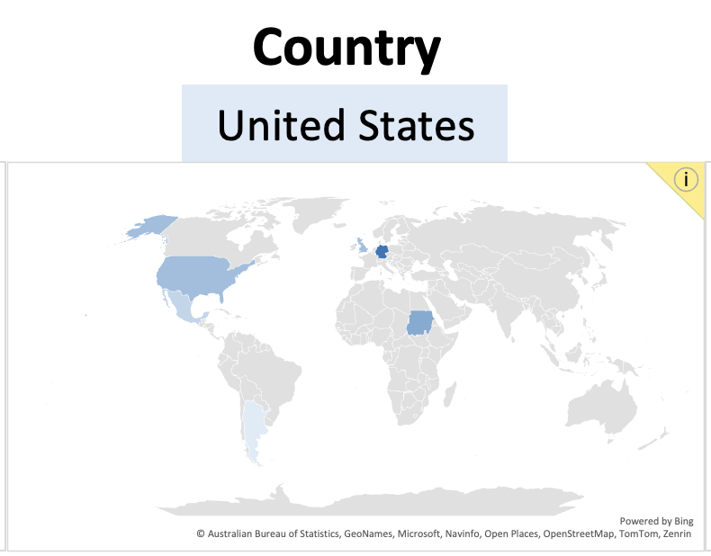
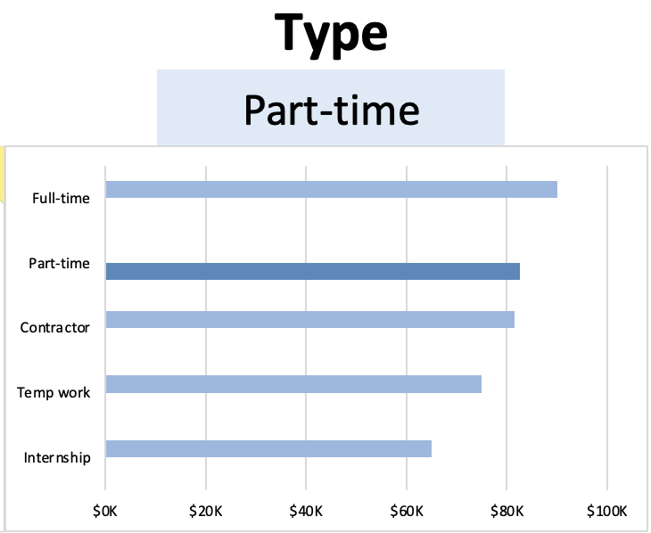

# Data Science Salary Dashboard

# Project 1

## Introduction

This job salary dashboard was created to help job seekers explore compensation trends and evaluate whether they are being fairly paid for their desired roles.

The analysis is based on 2023 job posting data, which includes detailed information on job titles, salaries, locations, and key skills. Using Excel, the dashboard transforms this data into clear, interactive visuals that make it easier to identify patterns in pay, demand, and required qualifications across different roles and regions.

### Dashboard File
My final dashboard is available for download: [Analysis_dashboard.xlsx](https://github.com/be910/Analysis-Dashboards/raw/main/DS_salary_dashboard/Analysis_Dashboard.xlsx)

### Excel Skills Used

The following Excel skills were utilized for analysis:

- **📉 Charts**
- **🧮 Formulas and Functions**
- **❎ Data Validation**

## Dashboard Build

### 📉 Charts

#### 📊 Data Science Job Salaries - Bar Chart

- 🛠️ **Excel Features:** Utilized bar chart feature (with formatted salary values) and optimized layout for clarity.
- 🎨 **Design Choice:** Horizontal bar chart for visual comparison of median salaries.
- 📉 **Data Organization:** Sorted job titles by descending salary for improved readability.
- 💡 **Insights Gained:** This enables quick identification of salary trends, noting that Senior roles and Engineers are higher-paying than Analyst roles.

#### 🗺️ Country Median Salaries - Map Chart

- 🛠️ **Excel Features:** Utilized Excel's map chart feature to plot median salaries globally.
- 🎨 **Design Choice:** Color-coded map to visually differentiate salary levels across regions.
- 📊 **Data Representation:** Plotted median salary for each country with available data.
- 👁️ **Visual Enhancement:** Improved readability and immediate understanding of geographic salary trends.
- 💡 **Insights Gained:** Enables quick grasp of global salary disparities and highlights high/low salary regions.

#### 📊 Job Scheduler Distribution – Bar Chart

- 🛠️ **Excel Features:** Created a bar chart to display the frequency of different job schedulers in 2023 job postings.
- **📊 Data Representation:** Shows the count of job postings associated with each scheduler.
- **💡 Insights Gained:** Highlights the most commonly used job schedulers in the dataset and industry trends.

