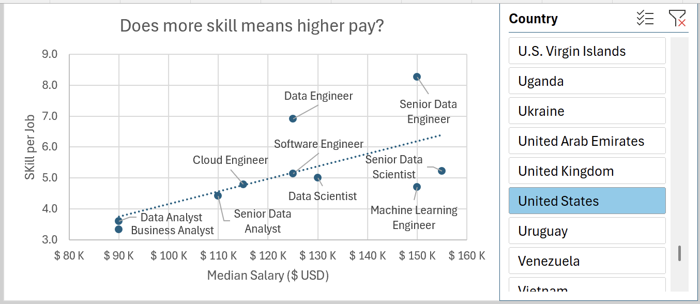
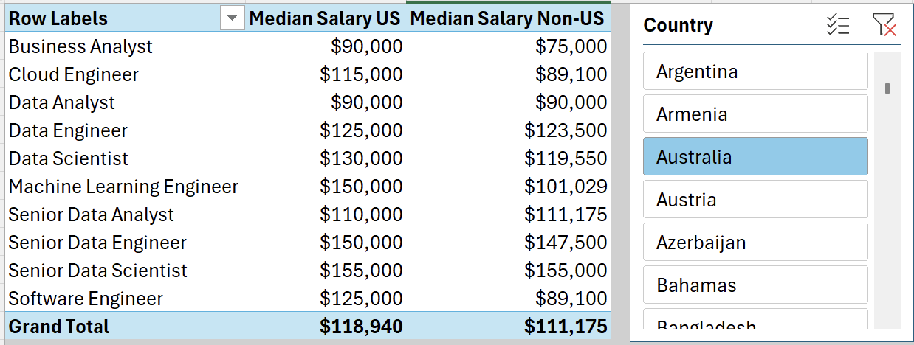
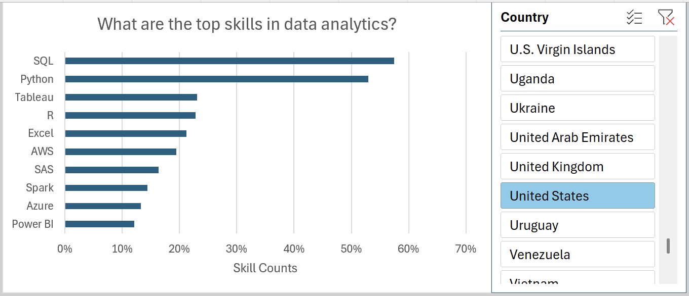
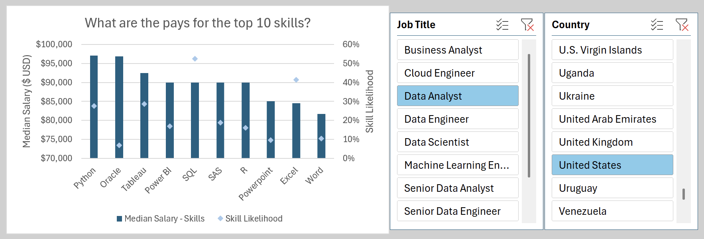

# Data Science Salary Dashboard

# Project 1

## Introduction

This job salary dashboard was created to help job seekers explore compensation trends and evaluate whether they are being fairly paid for their desired roles.

The analysis is based on 2023 job posting data, which includes detailed information on job titles, salaries, locations, and key skills. Using Excel, the dashboard transforms this data into clear, interactive visuals that make it easier to identify patterns in pay, demand, and required qualifications across different roles and regions.

### Dataset 
This dataset contains:
- **👨‍💼 Job titles**
- **💰 Salaries**
- **📍 Locations**
- **🛠️ Skills**

### Dashboard File
My final dashboard is available for download: [Analysis_dashboard.xlsx](https://github.com/be910/Analysis-Dashboards/raw/main/DS_salary_dashboard/Analysis_Dashboard.xlsx)

### Excel Skills Used

The following Excel skills were utilized for analysis:

- **📉 Charts**
- **🧮 Formulas and Functions**
- **❎ Data Validation**

## Dashboard Build

### 📉 Charts

#### 📊 Data Science Job Salaries - Bar Chart

- 🛠️ **Excel Features:** Utilized bar chart feature (with formatted salary values) and optimized layout for clarity.
- 🎨 **Design Choice:** Horizontal bar chart for visual comparison of median salaries.
- 📉 **Data Organization:** Sorted job titles by descending salary for improved readability.
- 💡 **Insights Gained:** This enables quick identification of salary trends, noting that Senior roles and Engineers are higher-paying than Analyst roles.

#### 🗺️ Country Median Salaries - Map Chart

- 🛠️ **Excel Features:** Utilized Excel's map chart feature to plot median salaries globally.
- 🎨 **Design Choice:** Color-coded map to visually differentiate salary levels across regions.
- 📊 **Data Representation:** Plotted median salary for each country with available data.
- 👁️ **Visual Enhancement:** Improved readability and immediate understanding of geographic salary trends.
- 💡 **Insights Gained:** Enables quick grasp of global salary disparities and highlights high/low salary regions.

#### 📊 Job Scheduler Distribution – Bar Chart

- 🛠️ **Excel Features:** Created a bar chart to display the frequency of different job schedulers in 2023 job postings.
- **📊 Data Representation:** Shows the count of job postings associated with each scheduler.
- **💡 Insights Gained:** Highlights the most commonly used job schedulers in the dataset and industry trends.

# Project 2

## Introduction

The data science job market is competitive and rapidly evolving, yet little structured analysis exists on what skills employers actually prioritize and how those skills translate to compensation. This project examines real job posting data to uncover patterns in employer demand, regional salary differences, and the financial value of specific technical skills.

### Questions to Analyze

1. **Do more skills get you better pay?**
2. **What's the salary for data jobs across regions?**
3. **What are the most in-demand skills for data professionals?**
4. **What's the pay for the top 10 skills?**

### Excel Skills Used

- **📊 Pivot Tables**
- **📈 Pivot Charts**
- **🧮 DAX (Data Analysis Expressions)**
- **🔍 Power Query**
- **💪 Power Pivot**

### Data Jobs Dataset

Same as project 1.

### Excel File
My final Excel file is available for download: [Salary_analysis_with_PowerQuery.xlsx](https://github.com/be910/Analysis-Dashboards/raw/main/Skill_analysis/Salary_analysis_with_PowerQuery.xlsx)

## 1️⃣ Do more skills get you better pay?

### 🔍 Skill: Power Query (ETL)

#### 💡 Insights

- 📈 There is a positive correlation between the number of skills requested in job postings and the median salary, particularly in roles like Senior Data Engineer and Data Scientist.
- 💼 Roles that require fewer skills, like Business Analyst, tend to offer lower salaries, suggesting that more specialized skill sets command higher market value.

## 2️⃣ What’s the salary for data jobs in different regions?

### Skills: PivotTables & DAX

#### 💡 Insights

- 💼 Job roles like Senior Data Engineer and Data Scientist command higher median salaries both in the US and internationally, showcasing the global demand for high-level data expertise.
- 💰 The salary disparity between US and Non-US roles is particularly notable in high-tech jobs, which might be influenced by the concentration of tech industries in the US.

## 3️⃣ What are the top skills of data professionals?

### Skill: Power Pivot

#### 💡Insights

- 💻 SQL and Python dominate as top skills in data-related jobs, reflecting their foundational role in data processing and analysis.
- ☁️ Emerging technologies like AWS and Azure also show significant presence, underlining the industry's shift towards cloud services and big data technologies.

## 4️⃣ What’s the pay of the top 10 skills?

### Skill: Advanced Charts (Pivot Chart)

#### 💡Insights

- 💰 Higher median salaries are associated with skills like Python, Oracle, and SQL, suggesting their critical role in high-paying tech jobs.
- 📉 Skills like PowerPoint and Word have the lowest median salaries and likelihood, indicating less specialization and demand in high-salary sectors.

